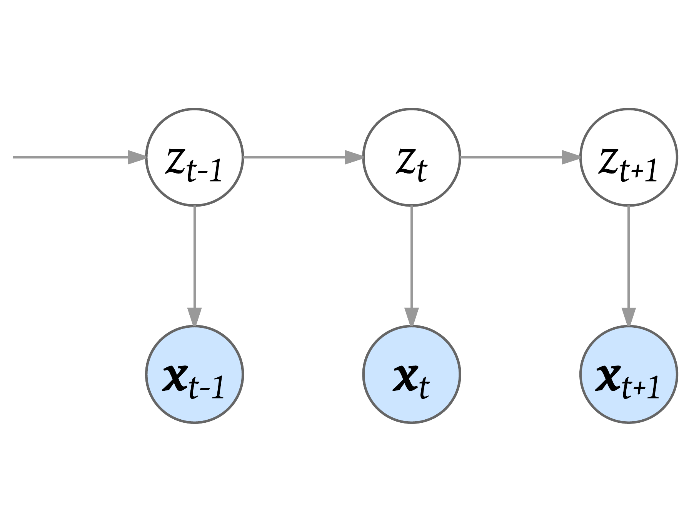
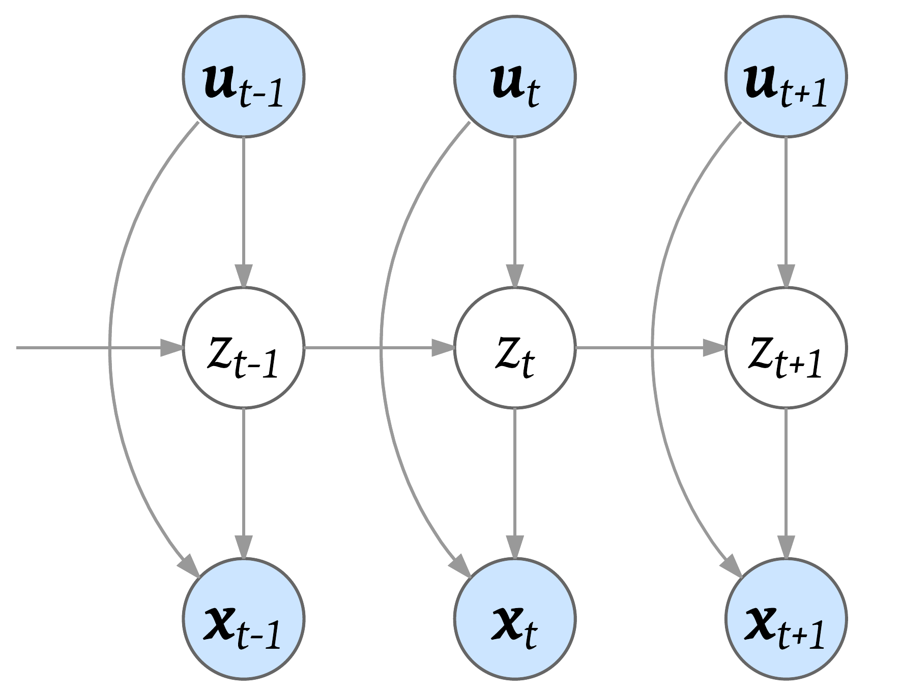

# IOHMM

A Python package of Input-Output Hidden Markov Model (IOHMM).

[](https://travis-ci.org/Mogeng/IOHMM) [](https://coveralls.io/github/Mogeng/IOHMM)

IOHMM extends standard HMM by allowing (a) initial, (b) transition and (c) emission probabilities to depend on various covariates. A graphical representation of  standard HMM and IOHMM:

| Standard HMM | IOHMM |
| --- | --- |
|   |  |


The solid nodes represent observed information, while the transparent (white) nodes represent latent random variables. The top layer contains the **observed** input variables *__u<sub>t</sub>__*; the middle layer contains **latent** categorical variable *z<sub>t</sub>*; and the bottom layer contains **observed** output variables *__x<sub>t</sub>__*. The input for (a) initial, (b) transition and (c) emission probabilities does not have to be the same.

For more theoretical details:
* [An Input Output HMM Architecture](https://papers.nips.cc/paper/964-an-input-output-hmm-architecture.pdf)
* [Input-output HMMs for sequence processing](http://ieeexplore.ieee.org/document/536317/)

Applications of IOHMM:
* [A Generative Model of Urban Activities from Cellular Data](http://ieeexplore.ieee.org/document/7932990/)
## Installing
```shell
pip install IOHMM
```

## Examples

The `example` directory contains a set of [Jupyter Notebook of examples and demonstrations](https://github.com/Mogeng/IOHMM/tree/master/examples/notebooks) of:

* [UnSupervised IOHMM](https://github.com/Mogeng/IOHMM/blob/master/examples/notebooks/UnSupervisedIOHMM.ipynb)

* [SemiSupervised IOHMM](https://github.com/Mogeng/IOHMM/blob/master/examples/notebooks/SemiSupervisedIOHMM.ipynb)

* [Supervised IOHMM](https://github.com/Mogeng/IOHMM/blob/master/examples/notebooks/SupervisedIOHMM.ipynb)

## Features

* **3-in-1 IOHMM**. IOHMM package supports:
  - [UnSupervised](https://en.wikipedia.org/wiki/Unsupervised_learning) IOHMM when you have no ground truth hidden states at any timestamp. [Expectation-Maximization (EM) algorithm](https://en.wikipedia.org/wiki/Expectation%E2%80%93maximization_algorithm) will be used to estimate parameters (maximization step) and posteriors (expectation step).
  - [SemiSupervised](https://en.wikipedia.org/wiki/Semi-supervised_learning) IOHMM when you have certain amount of ground truth hidden states and would like to enforce these labeled hidden states during learning and use these labels to help direct the learning process.
  - [Supervised](https://en.wikipedia.org/wiki/Supervised_learning) IOHMM when you want to purely use labeled ground truth hidden states during the learning. There will be no expectation step and only one shot of maximization step during the learning since all the posteriors are from labeled ground truth.

* __Crystal clear structure__. Know each step you go:
	- All sequences are represented by [pandas](http://pandas.pydata.org/) dataframes. It has great interface to load csv, json, etc. files or to pull data from sql databases. It is also easy to visualize.
	- Inputs and outputs covariates are specified by the column names (strings) in the dataframes.
	- You can pass a list of sequences (dataframes) as data -- there is no more need to tag the start of each sequence in a single stacked sequence.
	- You can specify different set of inputs for (a) initial, (b) transition and (c) different emission models.

* __Forward Backward algorithm__. Faster and more robust:
	- Fully [vectorized](https://en.wikipedia.org/wiki/Array_programming). Only one 'for loop' (due to [dynamic programming](https://en.wikipedia.org/wiki/Dynamic_programming)) in the forward/backward pass where most current implementations have more than one 'for loop'.
	- All calculations are at *log* level, this is more robust to long sequence for which the probabilities easily vanish to 0.

* __Json-serialization__. Models on the go:
	-  Save (`to_json`) and load (`from_json`) a trained model in json format. All the attributes are easily visualizable in the json dictionary/file. See [Jupyter Notebook of examples](https://github.com/Mogeng/IOHMM/tree/master/examples/notebooks) for more details.
	- Use a json configuration file to specify the structure of an IOHMM model (`from_config`). This is useful when you have an application that uses IOHMM models and would like to specify the model before hand.

* __Statsmodels and scikit-learn as the backbone__. Take the best of both and better:
	- Unified interface/wrapper to statsmodels and scikit-learn linear models/generalized linear models.
	- Supports fitting the model with sample frequency weights.
	- Supports regularizations in these models.
	- Supports estimation of standard error of the coefficients in certain models.
	- Json-serialization to save (`to_json`) and load (`from_json`) of trained linear models.

## Credits

* The structure of this implementation is inspired by depmixS4: [depmixS4: An R Package for Hidden Markov Models](https://cran.opencpu.org/web/packages/depmixS4/vignettes/depmixS4.pdf).
* This IOHMM package uses/wraps [statsmodels](http://www.statsmodels.org/stable/index.html) and [scikit-learn](http://scikit-learn.org/stable/) APIs for linear supervised models.

## Licensing

Modified BSD (3-clause)